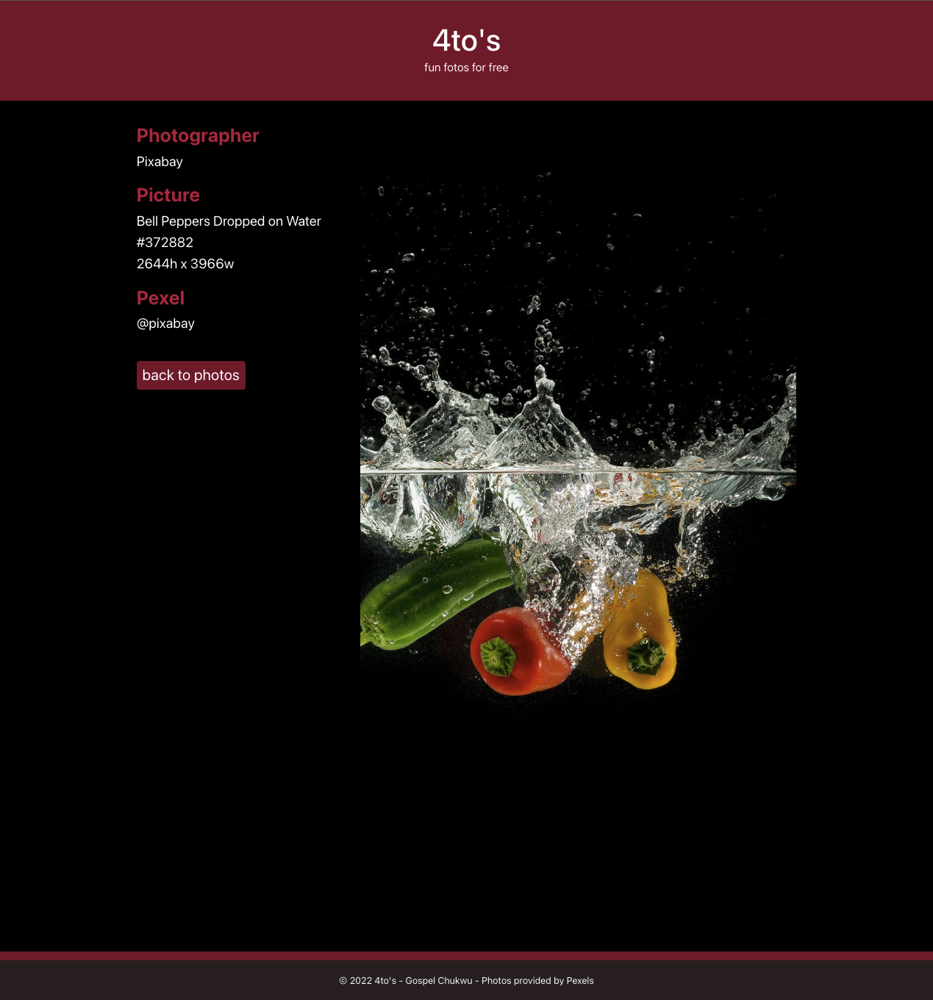

# 4to's - fun fotos for free!

## Project Description

4to's is a web app that welcomes our visitors with a selection of curated photos from Pexels and gives them the ability to search our extensive
catalog of quality photos from professional photographers using a text input and displays the photos in series of 10 photos at a time.

This project will be developed using ReactJS, Pexels API, Fetch, Git, ReactJS, NPM Modules, HTML5, Bootstrap. For live deployement, we will be using TBA.

---

## Table of Content

1. [Project Description](https://github.com/Brondchux/fotos#project-description)
2. [User Story](https://github.com/Brondchux/fotos#user-story)
3. [Acceptance Criteria](https://github.com/Brondchux/fotos#acceptance-criteria)
4. [Developers Getting Started](https://github.com/Brondchux/fotos#developers-getting-started)
5. [Mock-Up Preview](https://github.com/Brondchux/fotos#mock-up-preview)
6. [Useful Links](https://github.com/Brondchux/fotos#useful-links)
7. [Tech Stack](https://github.com/Brondchux/fotos#tech-stack)
8. [Contributors](https://github.com/Brondchux/fotos#contributors)
9. [Credits](https://github.com/Brondchux/fotos#credits)
10. [License](https://github.com/Brondchux/fotos#license)

---

## User Story

```md
As a user visiting the website...
I can see an initial set of curated photos on the home screen
I am able to access the the photographerʼs name and url if those details are available for
every photo
I can paginate the list of curated photos
I can use a text input to search for photos Iʼm interested
I can see the results of my search in the photo viewing area
I can paginate search results if needed
I should not be shown the "previous" paginiation button when there is no previous page
I can refresh my browser and retain my search query and/or page
```

---

## Acceptance Criteria

```md
Display 10 curated photos on the home screen. Use the Pexels curated photos resource to
render these photos.
Provide pagination for Curated photos. Paging should not cause a page refresh. From the
client side initiate the needed requests to allow the user to go forward and backward 10
photos at a time
Provide a photo search. Searching should not cause a page refresh. Consume the photo
search resource and display the results to the user, along with pagination, if needed
```

---

## Developers Getting Started

1. Clone repo from github https://github.com/Brondchux/fotos/
2. Navigate to fotos folder on your terminal
3. Using NPM, run "npm i"
4. Obtain your [Pexels API key here](https://www.pexels.com/onboarding)
   
5. Navigate to .env file in the root folder and add your API key as value for REACT_APP_PEXEL_KEY=xxxxxxxxxxxxxxxxxxxxxxxxxxxxxxxxxxxxxxxxxx
6. Then run "npm start"
7. View deployement on http://localhost:3000
8. Click on next or previous arrows to see another batch of curated photos
9. Search for your favourite type of photos, enjoy!

---

## Mock-Up Preview

The following photo(s) shows a preview of the application in production mode

1. Gallery display of photos

   

2. Picture displays a photo selected by the user

   

---

## Useful Links

1. 🗂 View the repository on [Github](https://github.com/Brondchux/fotos/)

---

## Tech Stack


---

## Contributors

Gospel Chukwu [@brondchux](https://github.com/Brondchux/)

Want to contribute? ping me brondchux@gmail.com

---

## Credits

[Rokt](https://www.rokt.com/) for giving me this frontend engineer assessment opportunity.

[Pexels API](https://www.pexels.com/api/documentation/) for making this api available with good documentation.

Special thanks to [Google](https://www.google.com/) for helping find accurate answers to my million questions in a very timely manner.

---

## License

[](https://opensource.org/licenses/MIT)
